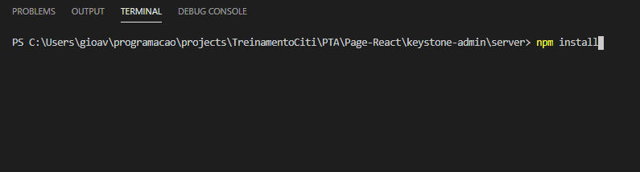
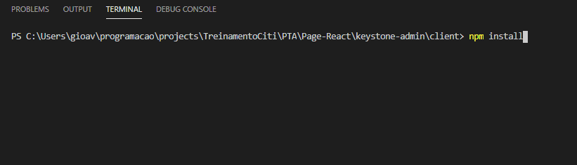
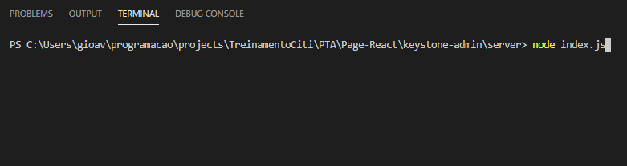
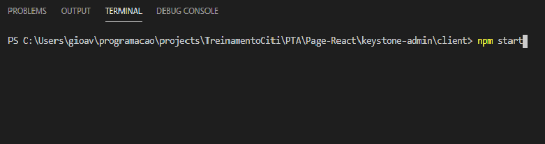
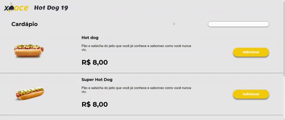

<h1 align = "center"> Desafio One-Page em <strong>React</strong> para ingresso no CITi-EJ <h1>

## Como rodar?

### Depois de clonar esse reposiório em alguma pasta no seu pc, voce vai precisar:

-Rodar o comando **npm install** na pasta server e na pasta client:

-Depois voce vai precisar subir o servidor rodando o comando **node index.js** na pasta server:

-Agora so falta executar o **React**, indo na pasta client e rodando o comando **npm start**:

## Pronto!

    

